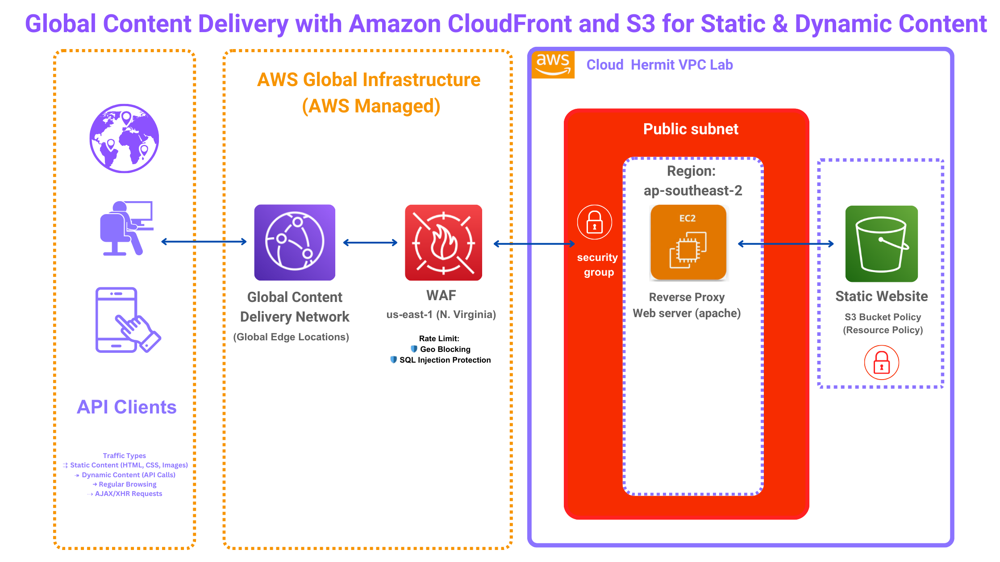
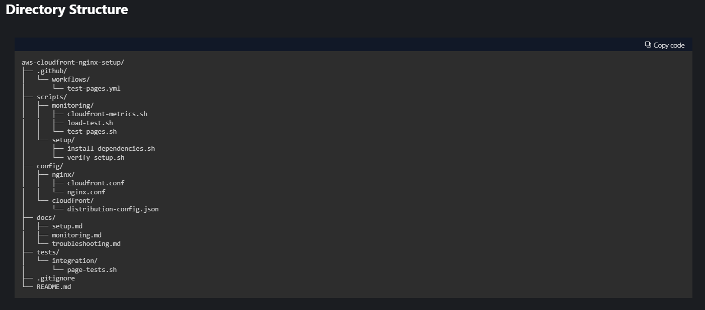
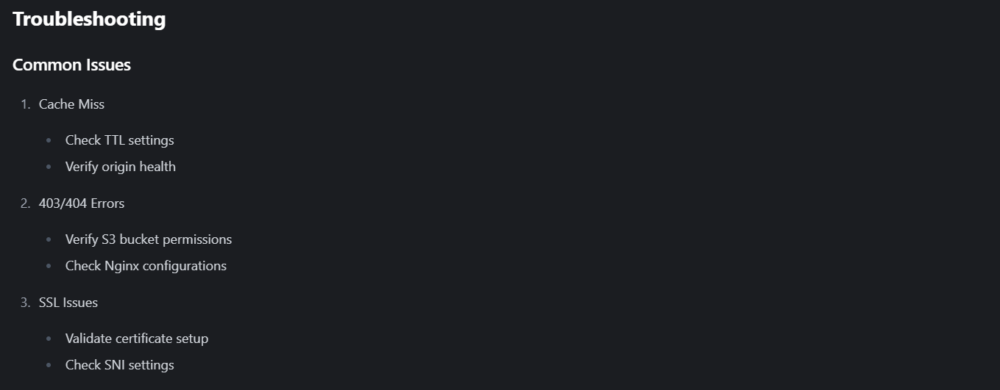

# Global-Content-Delivery-with-Amazon-CloudFront-and-S3

## Overview
An enterprise-grade setup for CloudFront distribution with Nginx reverse proxy serving content from S3 bucket. This solution provides global content delivery, enhanced security, and optimized performance.

## Architecture

### Components
- CloudFront Distribution
- Nginx Reverse Proxy on EC2
- S3 Static Website Hosting
- CloudWatch Monitoring
- Custom Domain Configuration

## Features
- Global content delivery through CloudFront
- Automated testing and monitoring
- Security-hardened setup
- Cache optimization
- Error handling
- Performance metrics collection

## Prerequisites
- AWS Account with appropriate permissions
- AWS CLI installed and configured
- EC2 instance running Amazon Linux 2
- Nginx server installed
- Python 3.x and pip
- Domain name (optional)

## Quick Start
1. Clone Repository

git clone https://github.com/yourusername/aws-cloudfront-nginx-setup.git
cd aws-cloudfront-nginx-setup

2. Install Dependencies

sudo yum install -y python3-pip python3-devel gcc
sudo pip3 install cryptography
sudo pip3 install --upgrade awscli

3. Configure Nginx
 
sudo cp config/nginx/cloudfront.conf /etc/nginx/conf.d/
sudo nginx -t
sudo systemctl reload nginx

4. Test Setup
bash
./scripts/monitoring/test-pages.sh

## Configuration
CloudFront Distribution
Default Root Object: index.html
Price Class: Configurable
SSL/TLS: SNI-only
HTTP/2: Enabled
Compression: Enabled
## Nginx Configuration
Basic reverse proxy configuration:

location / {
    proxy_pass http://[YOUR-S3-BUCKET-ENDPOINT];
    proxy_set_header Host $host;
    proxy_buffering off;
    proxy_redirect off;
}

## Monitoring and Testing
CloudFront Metrics
bash
./scripts/monitoring/cloudfront-metrics.sh

## Load Testing

./scripts/monitoring/load-test.sh
Page Testing
bash
./scripts/monitoring/test-pages.sh

## Security Features
SSL/TLS encryption
HTTP to HTTPS redirection
Custom headers
Origin access restrictions
Security group configurations

## Performance Optimization
Cache behaviors configured
Compression enabled
TTL settings optimized
Edge locations utilized

Check TTL settings
Verify origin health
403/404 Errors

Verify S3 bucket permissions
Check Nginx configurations
SSL Issues

## Validate certificate setup

Check SNI settings
Maintenance
Regular Tasks
Monitor CloudWatch metrics
Review access logs
Update security patches
Perform cache invalidations

##Cache Invalidation

aws cloudfront create-invalidation \
    --distribution-id [DISTRIBUTION-ID] \
    --paths "/*"

## Author 
Leonard Palad
Blog: https://www.cloudhermit.com.au/ 
LinkedIn: https://www.linkedin.com/in/leonardspalad/

## Acknowledgments
AWS Documentation | Nginx Documentation |CloudFront Best Practices Guide
