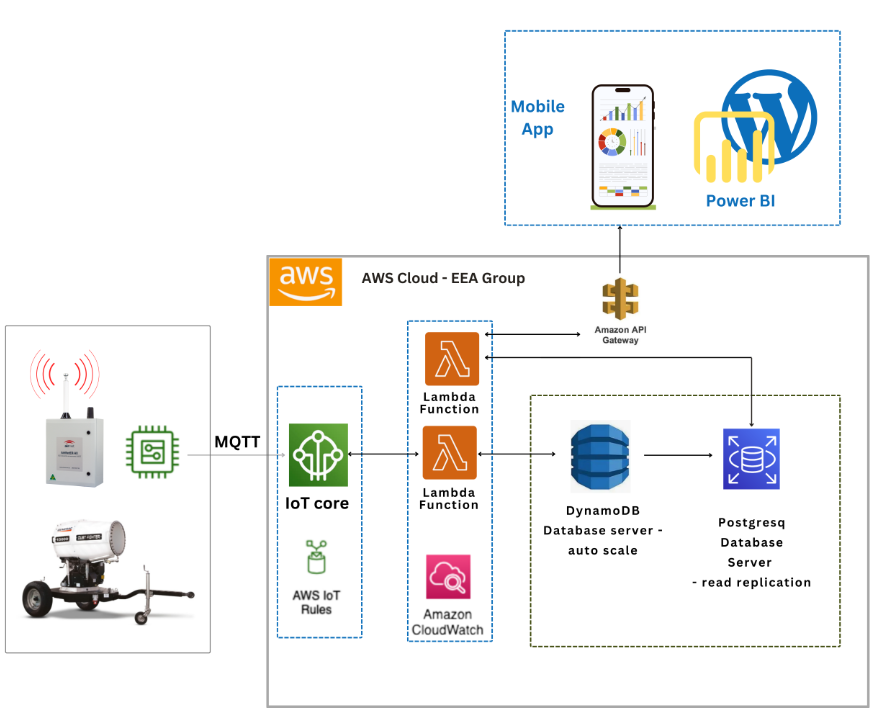

# AWS IoT Core Data Pipeline

A **serverless solution** for processing IoT sensor data using AWS IoT Core, Lambda, and DynamoDB.


## Architect Design



## Project Overview

This project implements a **data pipeline** for processing sensor data with the following components:

- **IoT Core** for MQTT message handling
- **Lambda functions** for data processing
- **DynamoDB** for data storage
- **API Gateway** for data access


## Repository Structure

```
aws-iot-lambda/
├── docs/                   # Documentation files
│   ├── architecture/       # Architecture design docs
│   ├── setup/              # Setup instructions
│   └── operations/         # Operational guides
├── lambda/                 # Lambda function code
├── iam/                    # IAM roles and policies
├── dynamodb/               # DynamoDB configurations
└── api/                    # API specifications
```


## Prerequisites

- **AWS Account** with appropriate permissions
- **AWS CLI** configured locally
- **Python 3.9+**
- **Node.js 14.x+** (for deployment scripts)


## Quick Start


### 1. Clone the Repository

```bash
git clone https://github.com/yourusername/aws-iot-lambda.git
cd aws-iot-lambda
```


### 2. Follow Setup Guides

- See **[Setup Requirements](./docs/setup/requirements.md)** for initial setup
- Follow **[Certificate Setup](./docs/setup/certificates.md)** for IoT device setup
- Review **[Policy Setup](./docs/setup/policy-setup.md)** for IAM configuration

  

### 3. Deploy the Solution


Run the deployment scripts following the documentation in the `setup` folder.


## Documentation

- **[Architecture](./docs/architecture/iot-core-setup.md)**
- **[Setup Requirements](./docs/setup/requirements.md)**
- **[Certificate Setup](./docs/setup/certificates.md)**
- **[Policy Setup](./docs/setup/policy-setup.md)**
- **[Message Format](./docs/operations/message-format.md)**
- **[Monitoring](./docs/operations/monitoring.md)**
- **[Troubleshooting](./docs/operations/troubleshooting.md)**


## Security

- **All IoT devices require valid certificates**
- **Lambda functions use least-privilege permissions**
- **DynamoDB tables use encryption at rest**
- **API endpoints implement proper authentication**


## License

This project is licensed under the **MIT License** - see the `LICENSE` file for details.


## Author

[Leonard Palad](https://www.linkedin.com/in/leonardspalad/)  
[Blog](https://www.cloudhermit.com.au/)  

**Created: February 2025**
